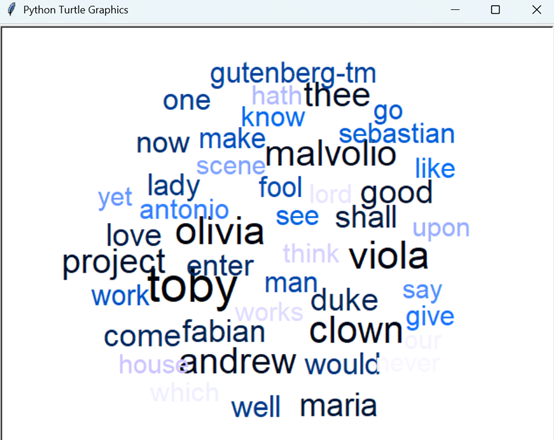

# 🎨 Word Cloud Visualization from Shakespeare's *Twelfth Night*

This project generates a **word cloud** based on the play *Twelfth Night* by William Shakespeare. It visualizes the most frequently used words (excluding common stop words) in a circular layout using Python's `turtle` graphics.

---

## 📂 Project Structure
📁 Job-Portal-Database-WordCloud/ │ ├── long.txt # Full text of "Twelfth Night" from Project Gutenberg ├── word_cloud.py # Main Python script that generates the word cloud ├── result.png # Screenshot of the resulting word cloud └── README.md # Project documentation


---

## 🐍 How It Works

- The script reads the full text from `long.txt`.
- Common stopwords and punctuation are removed.
- Word frequency is calculated using `defaultdict`.
- Words are placed randomly within a circular space, avoiding overlap.
- The size and color of each word reflect its frequency.
- The final result is displayed using Python’s built-in `turtle` graphics.

---

## 🖼 Preview

Here’s a preview of the word cloud generated from the play:



---

## 🚀 How to Run

Make sure you have Python installed, then:

```bash
python word_cloud.py

---

📘 Source Text
The input text long.txt is from Project Gutenberg, public domain.
